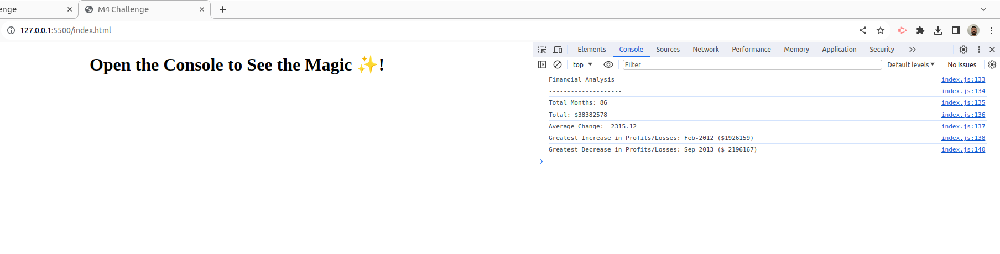

# console-finances
Financial Analysis

## Description 
Fundamentals of JavasScript, in this challenge of analysis financial we see
how to manipulate an array.

## Installation
N/A

## Usage

Too see this web application above you can access through this link [Console-Finances](https://lucasciofe.github.io/console-finances/).You can open Dev console by pressing `Command+Option+I`(MacOS) and `Control+Shift+I`(Windows) or `F12`. A console panel should open either below or to the side of the webpage in the browser. In this project we see how to manipulate an array such as extract data, sum up values of each element, use methods to simplify our work, like `.shift`, `.push`, `.toFixed()`, `Math.min(...)` and `Math.max(...)`

## Credits
N/A

## License
N/A